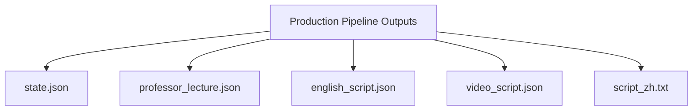

# CFA Factory 🎓

**AI-Powered CFA Study Video Factory** - Transform CFA curriculum into engaging educational videos using multi-agent debate.

## Overview

CFA Factory uses a multi-agent debate system (Professor vs Student) to deeply understand CFA materials and generate high-quality educational content. The system is built on Google's Agent Development Kit (ADK).

## Architecture

```mermaid
flowchart TD
  A[PDFs: Official/Schweser] --> B[Chunker<br/>LLM or rule-based]
  B --> C[chunks.jsonl]
  C --> D[Index (ChromaDB)]
  D --> E[Evidence Packet<br/>Reading-scoped]
  E --> F{Pipeline Mode}

  F -->|Debate| G[Router -> TA Outline -> Search -> Professor -> Student -> Synthesis -> Verifier]
  F -->|Production| H[Router -> TA Outline -> Search -> Professor -> Student -> Synthesis -> Verifier -> Lecture Draft -> Dialogue Expander -> Strict Expander -> Translator -> Continuity]
  F -->|Two-Phase| I[Outline Generator -> Scene Expander (loop) -> Translator]
```

```mermaid
flowchart TD
  A[PDF Page] --> B[PyMuPDF blocks + images + drawings]
  B --> C{needs_vision?}
  C -->|yes and llm_mode=vision-only/all| D[LLM chunker]
  C -->|no or llm disabled| E[Rule-based chunker]
  D --> F{LLM output ok?}
  F -->|yes| G[chunks (reading_id, section_path, no_cut)]
  F -->|no| E
  E --> G
```

```mermaid
flowchart TD
  A[chunks.jsonl] --> B[Chroma index (doc)]
  B --> C[Evidence Packet (reading_id)]
  B --> D{--cross-ref?}
  D -->|yes| E[Chroma index (unified)]
  E --> C
```



Notes:
- `--multi-round` inserts a deep-dive loop: Professor2 -> Student2 -> Synthesis2 before Verifier.
- `--with-editor` uses the Production pipeline; `--skip-translate` stops at `english_script.json`.
- Two-phase mode expands each scene sequentially (Outline -> Scene Expander loop -> Translator).

## Installation

```bash
# Clone the repository
git clone https://github.com/yourusername/cfa_factory.git
cd cfa_factory

# Install with uv (recommended)
uv sync

# Set up environment variables
cp .env.example .env
# Edit .env with your API keys:
# - GEMINI_API_KEY (required)
# - DEEPSEEK_API_KEY (optional, for Editor)
```

## Quick Start

```bash
# Step 1: Chunk the PDF into text segments (one time per book)
uv run cfa chunk --doc OFFICIAL_2026_L1_V9 --llm

# Step 2: Build the vector index (one time per book)
uv run cfa index --doc OFFICIAL_2026_L1_V9

# Optional: build unified cross-book index
uv run cfa index-all

# Step 3: Run the pipeline for a reading (reading_id is numeric, e.g. 1)
uv run cfa run --doc OFFICIAL_2026_L1_V9 --reading 1 --with-editor --cross-ref --prep

# Optional: English-only run (skip translation)
uv run cfa run --doc OFFICIAL_2026_L1_V9 --reading 1 --with-editor --cross-ref --prep --skip-translate

# Optional: Translate an existing english_script.json (per-scene, stable)
uv run cfa translate --doc OFFICIAL_2026_L1_V9 --reading 1

# Optional: Disable post-translation smoothing
uv run cfa translate --doc OFFICIAL_2026_L1_V9 --reading 1 --no-smooth-zh
```

## CLI Commands

| Command | Description |
|---------|-------------|
| `cfa chunk --doc DOC_ID` | Extract text chunks from PDF |
| `cfa index --doc DOC_ID` | Build ChromaDB vector index |
| `cfa packet --doc DOC_ID --reading 1` | Generate evidence packet |
| `cfa run --doc DOC_ID --reading 1 --with-editor` | Run pipeline with script generation |
| `cfa run --doc DOC_ID --reading 1 --with-editor --skip-translate` | English-only pipeline |
| `cfa translate --doc DOC_ID --reading 1` | Translate existing English script (per-scene + smoothing) |
| `cfa run --doc DOC_ID --reading 1 --multi-round` | Run multi-round debate (2-4 hour content) |
| `cfa vision extract --doc DOC_ID --reading R1` | Extract figures/formulas with Gemini Vision |

## Document IDs

### Official CFA Materials
| doc_id | Title |
|--------|-------|
| `OFFICIAL_2026_L1_V1` | Quantitative Methods |
| `OFFICIAL_2026_L1_V2` | Economics |
| `OFFICIAL_2026_L1_V3` | Corporate Issuers |
| `OFFICIAL_2026_L1_V4` | Financial Statement Analysis |
| `OFFICIAL_2026_L1_V5` | Equity Investments |
| `OFFICIAL_2026_L1_V6` | Fixed Income |
| `OFFICIAL_2026_L1_V7` | Derivatives |
| `OFFICIAL_2026_L1_V8` | Alternative Investments |
| `OFFICIAL_2026_L1_V9` | Portfolio Management |
| `OFFICIAL_2026_L1_V10` | Ethical and Professional Standards |

### Schweser Notes
| doc_id | Title |
|--------|-------|
| `SCHWESER_2026_L1_B1` | Quant, Economics, Corporate Issuers |
| `SCHWESER_2026_L1_B2` | FSA, Equity |
| `SCHWESER_2026_L1_B3` | Fixed Income, Derivatives |
| `SCHWESER_2026_L1_B4` | Alts, PM, Ethics |

## Batch Processing

Process all documents at once:

```bash
# Or manually:
for doc in OFFICIAL_2026_L1_V1 OFFICIAL_2026_L1_V3 ...; do
    uv run cfa chunk --doc $doc
    uv run cfa index --doc $doc
    # Process each reading...
done
```

Run a whole book (all readings) with the helper script:

```bash
./scripts/run_book.sh OFFICIAL_2026_L1_V3 --prep
```

Parallel version (set DOC/JOBS/FLAGS):

```bash
DOC=OFFICIAL_2026_L1_V3 JOBS=3 ./scripts/run_book_parallel.sh
```

Parallel translation for a whole book:

```bash
DOC=OFFICIAL_2026_L1_V3 JOBS=3 ./scripts/translate_book_parallel.sh
```

One-shot workflow (English-first, then parallel translation):

```bash
DOC=OFFICIAL_2026_L1_V3 JOBS=3 FLAGS="--with-editor --cross-ref --prep --skip-translate" ./scripts/run_book_parallel.sh
DOC=OFFICIAL_2026_L1_V3 JOBS=3 FLAGS="--parallel 4" ./scripts/translate_book_parallel.sh
```

Resume missing readings + translate (skips those already done):

```bash
./scripts/run_book_resume_translate.sh OFFICIAL_2026_L1_V3 -j 3
```

## Output Structure

```
output/
├── index/
│   ├── chunks/                # JSONL chunks
│   │   └── OFFICIAL_2026_L1_V9.jsonl
│   └── chroma/                # Vector indices
│       ├── OFFICIAL_2026_L1_V9/
│       └── unified/           # Cross-book index
├── runs/                      # Debate outputs
│   └── OFFICIAL_2026_L1_V9/
│       └── 1/
│           └── 20260105T001101/
│               ├── evidence_packet.json
│               ├── state.json
│               ├── professor_lecture.json
│               ├── english_script.json
│               ├── video_script.json
│               └── script_zh.txt
└── vision_assets/             # Extracted figures/formulas
```

## Multi-Round Debate (for 2-4 Hour Videos)

Single-round debate generates core claims. For full video coverage:

```bash
# Enable multi-round mode
uv run cfa run --doc OFFICIAL_2026_L1_V9 --reading 1 --multi-round
```

This runs:
- **Round 1:** Core first-principles claims
- **Round 2:** Exam traps, edge cases, misconceptions
- **Verification:** All claims audited against evidence

Expected output: ~15-20 claims per reading → suitable for 40+ minute video segment.

## Philosophical Lenses

The debate uses explicit philosophical frameworks:

**Professor:**
- First Principles (Aristotle)
- Dialectical Synthesis (Hegel)
- Systems Dynamics
- Signaling (Spence)

**Student:**
- Popperian Falsification
- Mandelbrotian Chaos (Fat Tails)
- Munger Inversion
- Taleb Fragility Probe

## Tech Stack

- **Framework:** Google ADK (Agent Development Kit)
- **Models:** Gemini 3 Flash/Pro
- **Vector Store:** ChromaDB
- **Embeddings:** text-embedding-004
- **PDF:** PyMuPDF

## Configuration

Defaults are read from `config/cfa.yaml`:

```yaml
min_claims: 80
min_scenes: 90
min_scene_words: 90
```

Override config file path with:

```bash
export CFA_CONFIG=/path/to/your.yaml
```

## License

MIT
