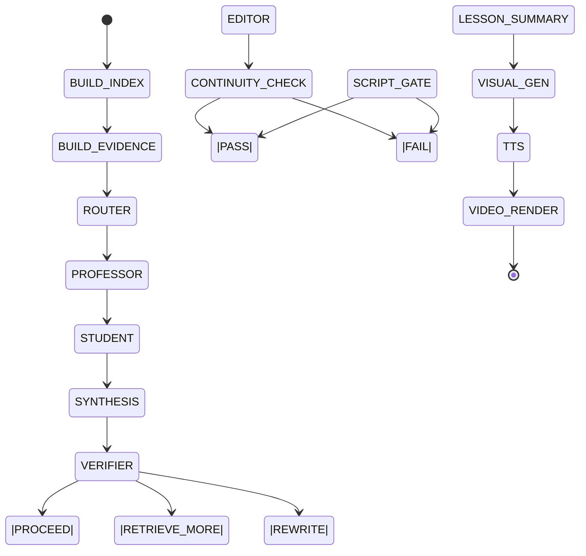

# Agents Specification (CFA Video Factory)

This document defines all Agents in the system, their responsibilities,
inputs/outputs, constraints, and interaction contracts.

Agents are orchestrated by a Python Orchestrator (Google Agent SDK).
Agents NEVER directly access raw PDFs unless explicitly stated.

---

## 1. Router Agent

### Purpose
Classify a CFA Reading into a cognitive / pedagogical mode and output a
strict configuration for downstream stages.

### Model
Gemini Flash (Developer API)

### Input
- reading_id
- reading_title
- short textual summary (<= 1,000 chars, extracted from text chunks)
- Book Glossary Cache (global)
- Book Spine (global)

### Output (STRICT JSON)
```json
{
  "mode": "MODE_PHYSICS | MODE_GAME | MODE_SYSTEM | MODE_ETHICS",
  "segment_minutes": null,
  "required_beats": [
    "misconception",
    "first_principles",
    "numeric_example",
    "exam_trap",
    "synthesis",
    "quiz"
  ],
  "retrieval_queries": ["string", "..."]
}
```

### Constraints
- No free text.
- No explanation outside JSON.
- Router does NOT generate content.
- segment_minutes is legacy and ignored (no fixed duration).

---

## 2. Professor Agent

### Purpose
Generate FIRST-PRINCIPLES claims from verified evidence.
Represents the "theory builder".

### Model
Gemini Pro (Developer API)

### Input
- EvidencePacket (filtered)
- Router configuration
- Optional Student challenges (later rounds)
- Book Glossary Cache (global)
- Book Spine (global)

### Output (STRICT JSON)
```json
{
  "claims": [
    {
      "claim_id": "string",
      "statement_en": "string",
      "citations": ["doc_id|page|chunk_id"],
      "knowledge_scope": "IN_PDF | OUTSIDE_PDF"
    }
  ]
}
```

### Constraints
- Every claim MUST include citations.
- No storytelling.
- No long prose.
- Claims must be atomic and verifiable.
- OUTSIDE_PDF allowed only if explicitly labeled and cited.
- If google_search is used, include URL citations and mark OUTSIDE_PDF.

---

## 3. Student Agent

### Purpose
Attack, falsify, or stress-test Professor claims.
Represents exam pressure + market realism.

### Model
Gemini Flash

### Input
- Professor claims
- EvidencePacket
- Router mode
- Book Glossary Cache (global)
- Book Spine (global)

### Output (STRICT JSON)
```json
{
  "challenges": [
    {
      "target_claim_id": "string",
      "attack_type": "EDGE_CASE | MODEL_RISK | INCENTIVE | BEHAVIORAL",
      "challenge_statement": "string",
      "citations": ["doc_id|page|chunk_id"]
    }
  ]
}
```

### Constraints
- Must reference at least one claim.
- Must cite evidence.
- No new facts without citation.
- Outside sources allowed only if cited.
- If google_search is used, include URL citations.

---

## 4. Verifier Agent (Gatekeeper)

### Purpose
Audit all claims/challenges against evidence.
This is the semantic gate.

### Model
Gemini Flash

### Input
- Professor claims
- Student challenges
- EvidencePacket (exact referenced chunks)
- Book Glossary Cache (global)
- Book Spine (global)

### Output (STRICT JSON)
```json
{
  "verdicts": [
    {
      "claim_id": "string",
      "status": "PASS | WEAK | HALLUCINATION",
      "reason": "string",
      "fix_suggestion": "string | null"
    }
  ],
  "overall_decision": "PROCEED | RETRIEVE_MORE | REWRITE"
}
```

### Constraints
- No new content generation.
- Only judgment.
- If HALLUCINATION exists -> overall_decision != PROCEED.
- OUTSIDE_PDF claims should be WEAK or OUT_OF_SCOPE (not HALLUCINATION).
- Verifier may use google_search for citation checks, but must not add new facts.

---

## 5. Editor Agent

### Purpose
Convert VERIFIED claims into long-form Chinese teaching scripts.

### Model
DeepSeek V3 (preferred) or Gemini Flash (fallback)

### Input
- Verified claims only
- Router required_beats
- Visual assets references
- Book Glossary Cache (global)
- Book Spine (global)

### Output (STRICT JSON)
```json
{
  "segment_id": "string",
  "duration_est_min": 10,
  "scenes": [
    {
      "beat": "misconception | first_principles | numeric_example | ...",
      "display_zh": "string",
      "spoken_zh": "string",
      "citations": ["doc_id|page|chunk_id"],
      "visual_refs": ["asset_id"],
      "quiz": {
        "type": "MCQ | TF",
        "question_zh": "string",
        "choices": ["A. ...", "B. ...", "C. ..."],
        "answer": "B",
        "explanation_zh": "string",
        "answer_citations": ["doc_id|page|chunk_id"]
      }
    }
  ]
}
```

### Constraints
- NO new facts.
- NO access to PDFs.
- Formulas:
  - display_zh -> LaTeX
  - spoken_zh -> natural Chinese explanation
- If beat == "quiz", the quiz field is required and must be schema-valid.

---

## 6. Visual Director Agent

### Purpose
Generate visual intermediate representations (IR).

### Model
Gemini Flash

### Input
- Verified claims
- Editor script (high-level)
- Book Glossary Cache (global)
- Book Spine (global)

### Output (STRICT JSON)
```json
{
  "assets": [
    {
      "asset_id": "string",
      "type": "mermaid | matplotlib",
      "spec": "string"
    }
  ]
}
```

### Constraints
- No image hallucination.
- Diagrams must be reproducible from code.

---

## 7. Vision Extract Agent (Phase 0.5)

### Purpose
Extract formulas, tables, figures from PDF pages.

### Model
Gemini Flash / Pro (multimodal)

### Input
- Page image (PNG)
- doc_id / reading_id / page

### Output
Structured assets:
- FormulaAsset
- FigureAsset
- TableAsset

### Constraints
- Page-level only.
- Output must be schema-valid.

---

## 8. Continuity Checker (Gate)

### Purpose
Validate cross-lesson coherence and required lesson scaffolding.

### Model
Gemini Flash

### Input
- Lesson script (display_zh + spoken_zh)
- Book Glossary Cache
- Previous lesson_summary.json (if any)

### Output (STRICT JSON)
```json
{
  "terminology_inconsistent": ["string"],
  "missing_recap": false,
  "missing_preview": false,
  "dangling_reference": ["string"],
  "fix_suggestions": ["string"]
}
```

### Constraints
- No new facts.
- Only identify issues and suggest wording/structure fixes.
- If any issue is found -> return to Editor for rewrite (no new facts).

---

## 9. Search Agent

### Purpose
Perform web search and summarize external sources with URLs. Other agents may
consume this as search_context but cannot call tools directly.

### Model
Gemini Flash

### Input
- reading_title
- lesson_plan.retrieval_queries

### Output
STRICT JSON (SearchContextSchema).

### Constraints
- No facts without URLs.
- Keep it concise; do not invent sources.

---

## Engineering Conventions

- Agents NEVER see raw PDFs unless explicitly allowed.
- Editor NEVER introduces new facts.
- Verifier is final authority.
- All outputs must be JSON.
- All JSON must be schema-validated.
- No step overwrites previous artifacts.
- All retries are localized.
- Lesson cuts must respect no_cut boundaries.
- Recap/Preview are mandatory for every lesson.
- Only the Search Agent may call google_search; other agents consume search_context only.

---

## Chunking and Lesson Boundaries

### LLM Block Chunking (PyMuPDF + LLM)
- Use PyMuPDF to extract text blocks and image bboxes per page.
- LLM labels blocks (正文/LOS/Exhibit/Example/Question/Solution) and groups blocks into chunks.
- LLM assigns content_type and no_cut, and links image blocks to nearby captions.
- Chunk metadata includes bbox/page_size/block_ids/image_bboxes for precise positioning.

### Reading Map Builder (TOC/Reading Start)
- CLI: `cfa reading-map --doc <DOC_ID>` (uses Gemini to confirm reading starts).
- Updates `assets/reading_map.json` with page_start/page_end per reading.
- Use `--no-llm` to disable confirmation (regex-only fallback).

### 1.1 Reading and Section Boundaries (Hard Rule)
- Reading is the primary atom.
- LOS / section is the secondary atom.
- Populate section_path in each chunk, from coarse to fine, e.g.
  ["R1", "LOS 1.a", "Exhibit 1"].
- When building Lessons, cut only on section boundaries whenever possible.

### 1.1 V1 Cut-Point Heuristics (No directory parsing)
- Detect these anchors in text and mark as cut points:
  - LOS
  - Example
  - Exhibit
  - Summary
  - Key Concepts

### 1.2 Hard No-Cut Zones
Do NOT split a Lesson across:
- Formula derivation blocks ("therefore", "derive", "Step 1/2/3", or
  consecutive formula chunks)
- Exhibit/table interpretation blocks (figure/table chunk + following
  explanation chunk)
- Example question stem + solution

Implementation:
- Add no_cut = true in chunk metadata (chunker or vision extract).
- Lesson assignment may only cut at no_cut == false positions.

---

## Book Memory (Global, Mandatory)

### 2.1 Book Glossary Cache
A single, small, strict glossary shared by all agents.

Format (JSON):
```json
{
  "term_map": { "risk premium": "风险溢价", "utility": "效用" },
  "symbol_map": { "σ": "标准差", "ρ": "相关系数 rho" },
  "style_rules": { "avoid": ["分之"], "preferred": ["除以"] }
}
```

All agents MUST consume this cache (Professor/Student/Verifier/Editor/Router).

### 2.2 Book Spine
A 15–25 line outline of the entire book:
- Each line: Reading -> 3 key points -> key exhibits/formulas
- Output as book_spine.md or book_spine.json

Every Lesson must load the spine before writing, so it knows where it fits
in the book narrative.

---

## Lesson-Level Coherence Template

Each Lesson must contain three fixed modules
(checked by Script Gate):

### 3.1 Recap (short)
- Summarize 3 key takeaways from previous lesson.
- For Lesson 1: summarize the book structure using Book Spine.

### 3.2 Body (main content)
- Composed of 8–12 minute segments.
- Each segment still follows required beats.

### 3.3 Preview (short)
- State 2–3 questions next lesson will answer.
- Provide explicit linkage (e.g., "next we apply this to IPS risk budget").

---

## Lesson Summary (for next Recap)

At the end of each lesson, generate:
```json
{
  "lesson_id": "L2",
  "key_takeaways": ["...", "...", "..."],
  "formulas_used": ["..."],
  "exhibits_used": ["..."],
  "open_loops": ["..."]
}
```

This summary is the ONLY source for the next lesson Recap.

---

## Lesson Boundary (Reading-First)

- Each Reading produces one Lesson. Do not mix readings inside a lesson.
- No fixed duration target. segment_minutes is legacy and ignored.
- If a Reading is exceptionally long, only split on section_path boundaries and
  no_cut == false (manual override).

---

## Optional Lesson -> Segment Split (No Time Targets)

- Segments are optional; if used, split by section_path and cut points only.
- All segment boundaries must respect no_cut == false.
- No duration targets are enforced.

---

## Script Gate (Structure-First)

### Segment gate
- All required beats covered.
- Quiz beat includes quiz payload.
- No new facts.

### Lesson gate
- Recap / Body / Preview present.
- Required beats covered across the lesson.

### Continuity gate
- Run Continuity Checker after Editor output.
- If issues -> rewrite with wording/bridges only (no new facts).

---

## Quiz Beat (V1 Frozen)

### Types
- MCQ (single choice)
- TF (true/false)

### Scene payload (beat == "quiz")
```json
{
  "beat": "quiz",
  "display_zh": "...",
  "spoken_zh": "...",
  "citations": ["doc|page|chunk"],
  "quiz": {
    "type": "MCQ",
    "question_zh": "...",
    "choices": ["A. ...", "B. ...", "C. ..."],
    "answer": "B",
    "explanation_zh": "...",
    "answer_citations": ["doc|page|chunk"]
  }
}
```

TF example:
```json
{
  "quiz": {
    "type": "TF",
    "question_zh": "...",
    "answer": true,
    "explanation_zh": "...",
    "answer_citations": ["doc|page|chunk"]
  }
}
```

Constraints:
- Every quiz must include answer_citations.
- No new numbers or facts outside evidence.

---

## Handout Markdown Template (V1)

### 3.1 File structure
- output/handouts/{doc_id}/{reading_id}/handout.md
- Optional: per-segment markdown, then merge.

### 3.2 Template
```markdown
---
doc_id: OFFICIAL_2026_L1_V9
reading_id: R1
run_id: 20260104T232645
generated_at: 2026-01-04
---

# Reading R1 — {Reading Title}

> 来源：CFA Official Curriculum + Schweser Notes（如启用）
> 本讲义由脚本 JSON 自动生成；口语文本（spoken_zh）已剔除，仅保留书面展示（display_zh）。

---

## 目录
- [Segment 1](#segment-1)
- [Segment 2](#segment-2)
- ...

---

## Segment 1
### 1. Misconception（常见误解）
{display_zh}

[^1]: OFFICIAL_2026_L1_V9 p.15 chunk:a17bdb...

### 2. First Principles（第一性原理）
{display_zh}

### 3. Numeric Example（数值例题）
{display_zh}

### 4. Exam Trap（考试陷阱）
{display_zh}

### 5. Synthesis（综合结论）
{display_zh}

### 6. Quiz（小测）
**题目（单选）**：{question_zh}  
A. ...  
B. ...  
C. ...  

**答案**：B  
**解析**：{explanation_zh}

---

## 图表与可视化
> 下列图片/图形由 Visual Director 生成或从教材页抽取（经结构化提取）。

### Figure: {caption}


---

## 术语表（Glossary Used）
- **Term**：解释……[^n]

---

## 引用（Footnotes）
（由脚注自动汇总）
```

### 3.3 Footnote format
- {doc_id} p.{page} chunk:{chunk_id}

### 3.4 Figure insertion rule
- visual_refs -> output/visuals/{run_id}/{asset_id}.png
- Place all figures in "图表与可视化" section by default.
- If a scene depends on a figure, insert it inline after that scene.

---

## Schemas (Reference)

### Chunk.schema.json
```json
{
  "$schema": "http://json-schema.org/draft-07/schema#",
  "title": "Chunk",
  "type": "object",
  "required": [
    "schema_version",
    "chunk_id",
    "doc_id",
    "kind",
    "page",
    "content_type",
    "content",
    "content_hash"
  ],
  "properties": {
    "schema_version": { "const": "v1" },
    "chunk_id": { "type": "string" },
    "doc_id": { "type": "string" },
    "kind": { "enum": ["official", "schweser"] },
    "page": { "type": "integer", "minimum": 1 },
    "reading_id": { "type": ["string", "null"] },
    "section_path": {
      "type": "array",
      "items": { "type": "string" }
    },
    "no_cut": { "type": "boolean" },
    "content_type": {
      "enum": ["text", "table", "formula", "figure"]
    },
    "content": { "type": "string" },
    "span": {
      "type": ["object", "null"],
      "properties": {
        "start_char": { "type": "integer" },
        "end_char": { "type": "integer" },
        "start_line": { "type": ["integer", "null"] },
        "end_line": { "type": ["integer", "null"] }
      }
    },
    "content_hash": { "type": "string" },
    "source_path": { "type": ["string", "null"] },
    "image_ref": { "type": ["string", "null"] },
    "extracted_struct": {
      "type": ["object", "null"],
      "description": "Structured multimodal extraction (table/formula/figure)"
    },
    "bbox": {
      "type": ["array", "null"],
      "items": { "type": "number" },
      "description": "Chunk bounding box [x0,y0,x1,y1]"
    },
    "page_size": {
      "type": ["array", "null"],
      "items": { "type": "number" },
      "description": "Page size [width,height]"
    },
    "block_ids": {
      "type": ["array", "null"],
      "items": { "type": "integer" }
    },
    "image_block_ids": {
      "type": ["array", "null"],
      "items": { "type": "integer" }
    },
    "image_bboxes": {
      "type": ["array", "null"],
      "items": {
        "type": "array",
        "items": { "type": "number" }
      }
    }
  }
}
```

### EvidencePacket.schema.json
```json
{
  "$schema": "http://json-schema.org/draft-07/schema#",
  "title": "EvidencePacket",
  "type": "object",
  "required": [
    "schema_version",
    "doc_id",
    "reading_id",
    "run_id",
    "reading_fulltext"
  ],
  "properties": {
    "schema_version": { "const": "v1" },
    "doc_id": { "type": "string" },
    "reading_id": { "type": "string" },
    "run_id": { "type": "string" },
    "reading_fulltext": {
      "type": "array",
      "items": { "$ref": "Chunk.schema.json" }
    },
    "top_k": {
      "type": "array",
      "items": {
        "type": "object",
        "required": ["query", "k", "hits"],
        "properties": {
          "query": { "type": "string" },
          "k": { "type": "integer" },
          "hits": {
            "type": "array",
            "items": {
              "type": "object",
              "required": ["chunk_id", "doc_id", "page", "score", "snippet"],
              "properties": {
                "chunk_id": { "type": "string" },
                "doc_id": { "type": "string" },
                "page": { "type": "integer" },
                "score": { "type": "number" },
                "snippet": { "type": "string" }
              }
            }
          }
        }
      }
    },
    "conflicts": {
      "type": "array",
      "items": { "type": "object" }
    },
    "meta": { "type": "object" }
  }
}
```

### VerifierOutput.schema.json
```json
{
  "$schema": "http://json-schema.org/draft-07/schema#",
  "title": "VerifierOutput",
  "type": "object",
  "required": ["verdicts", "overall_decision"],
  "properties": {
    "verdicts": {
      "type": "array",
      "items": {
        "type": "object",
        "required": ["claim_id", "status"],
        "properties": {
          "claim_id": { "type": "string" },
          "status": { "enum": ["PASS", "WEAK", "HALLUCINATION"] },
          "reason": { "type": "string" },
          "fix_suggestion": { "type": ["string", "null"] }
        }
      }
    },
    "overall_decision": {
      "enum": ["PROCEED", "RETRIEVE_MORE", "REWRITE"]
    }
  }
}
```

### VideoScript.schema.json
```json
{
  "$schema": "http://json-schema.org/draft-07/schema#",
  "title": "VideoScript",
  "type": "object",
  "required": ["segment_id", "scenes"],
  "properties": {
    "segment_id": { "type": "string" },
    "duration_est_min": { "type": ["integer", "null"], "minimum": 0 },
    "scenes": {
      "type": "array",
      "items": {
        "type": "object",
        "required": ["beat", "display_zh", "spoken_zh", "speaker"],
        "properties": {
          "beat": {
            "enum": [
              "misconception",
              "first_principles",
              "numeric_example",
              "exam_trap",
              "synthesis",
              "quiz"
            ]
          },
          "speaker": { "enum": ["Professor", "Student", "Narrator"] },
          "display_zh": { "type": "string" },
          "spoken_zh": { "type": "string" },
          "citations": {
            "type": "array",
            "items": { "type": "string" }
          },
          "visual_refs": {
            "type": "array",
            "items": { "type": "string" }
          },
          "quiz": {
            "type": ["object", "null"],
            "properties": {
              "type": { "enum": ["MCQ", "TF"] },
              "question_zh": { "type": "string" },
              "choices": {
                "type": ["array", "null"],
                "items": { "type": "string" },
                "minItems": 2
              },
              "answer": { "type": ["string", "boolean"] },
              "explanation_zh": { "type": "string" },
              "answer_citations": {
                "type": "array",
                "items": { "type": "string" }
              }
            }
          }
        }
      }
    }
  }
}
```

---

## Orchestrator Core Principles

- Reading is the primary unit of work.
- LOS / section is the secondary unit of structure.
- Lesson is the smallest delivery unit (about 40 minutes).
- Segment is the smallest failure rollback unit.
- Any step failure does not affect other Readings.

---

## State Machine



### State Semantics (Engineering Meaning)

| State | Meaning |
| --- | --- |
| BUILD_INDEX | PDF -> Chunk -> Vector |
| BUILD_EVIDENCE | Reading-level evidence packet |
| ROUTER | Decide pedagogy + beats |
| PROFESSOR | Atomic theory claims |
| STUDENT | Attack / find weaknesses |
| SYNTHESIS | Reconcile claims into teachable conclusions |
| VERIFIER | Fact gate |
| EDITOR | Long-form generation (DeepSeek V3 / fallback Gemini Flash) |
| CONTINUITY_CHECK | Recap/preview + glossary consistency gate |
| SCRIPT_GATE | Length + beat completeness validation |
| LESSON_SUMMARY | Structured summary for next Recap |
| VISUAL_GEN | Mermaid / Matplotlib |
| TTS | GPT-SoVITS |
| VIDEO_RENDER | MoviePy -> MP4 |

---

## Editor System Prompt (Final)

```
# Role: CFA Editor (Long-form Teaching Script Generator)

You are a professional CFA course scriptwriter.
You DO NOT invent facts.
You ONLY elaborate on VERIFIED CLAIMS.

---

## Input You Will Receive
- Verified claims (with citations)
- Required beats (list)
- Visual asset references
- Book Glossary Cache
- Book Spine

---

## HARD RULES (VIOLATION = REJECT)
1. You MUST cover ALL required beats.
2. You MUST NOT introduce new facts.
3. EVERY formula:
   - display_zh: keep LaTeX
   - spoken_zh: natural Chinese explanation, do NOT read symbols.
4. If content is insufficient to reach target duration:
   - Expand with examples, analogies, or step-by-step reasoning
   - NEVER add new facts
5. If beat == "quiz", follow the Quiz schema exactly.

---

## Length Guidance (No Fixed Target)
- No fixed duration target; expand as needed to cover all verified claims and beats.
- If content feels thin, add examples, analogies, or step-by-step reasoning
  without introducing new facts.

---

## Output Format
You MUST output JSON strictly matching VideoScript schema.
No commentary outside JSON.

---

## Tone
- Clear
- Patient
- Spoken Mandarin
- Teaching, not summarizing

You are writing for AUDIO-FIRST consumption.
Assume listener may not see the screen.
```

---

## Editor Model Fallback Rules

Primary: DeepSeek V3 (Chinese, long-form).

Fallback (trigger conditions):
- Timeout
- Schema invalid
- Token truncation

Fallback prompt is identical; only the model changes.

Runtime override:
- Set `EDITOR_BACKEND=gemini` to force Gemini editor.
- Default is DeepSeek when `DEEPSEEK_API_KEY` is present.

---

## V1 Frozen Decisions

- Cloud LLM: Gemini Developer API
- Editor: DeepSeek V3 primary, Gemini Flash fallback
- Outputs: Video + Handout (Markdown)
- Quiz types: MCQ + True/False
- Handout: footnote + figure insertion conventions as specified above

---

## M2 Router Decision Logic

Primary map (deterministic preference):
- MODE_PHYSICS: Quant, Fixed Income, Derivatives, formula-heavy readings.
- MODE_GAME: FSA, Corporate Issuers, accounting rules, incentives.
- MODE_SYSTEM: Economics, Equity, Portfolio, system dynamics, equilibrium.
- MODE_ETHICS: Ethics, GIPS, professional standards.

Fallbacks:
- If ambiguous, choose the closest fit from reading_summary.
- If still ambiguous, use previous reading mode; else default MODE_SYSTEM.

Router output rules (unchanged schema):
- required_beats must include the canonical list.
- segment_minutes is legacy; set to null.
- retrieval_queries must be short, evidence-seeking.
- lesson_outline is a single sentence.

---

## Synthesis Agent Spec (M2)

### Purpose
Converge Professor claims and Student challenges into teachable, testable conclusions.

### Model
gemini-3-pro-preview

### Input
- Professor claims
- Student challenges
- EvidencePacket
- Book Glossary Cache
- Book Spine

### Output (STRICT JSON)
SynthesisClaimsSchema

### Constraints
- No new facts.
- Every claim must include citations.
- reasoning summarizes boundaries + exam framing in 3-6 sentences.
- Must obey Book Glossary terminology and symbol naming.

---

## M2 Prompt Pack (English)

Location: `src/cfa_factory/agents/prompts.py`

Composition:
- Base prompt: role, inputs, hard rules.
- Mode plugin: cognitive lens per MODE_*.
- Output constraints: strict JSON only, schema name, no markdown.

Best practices enforced:
- Explicit sections (Inputs, Rules, Output).
- No raw PDF access; EvidencePacket only.
- Book Glossary Cache + Book Spine injected every turn.
- Mode guidance embedded in the prompt (no hidden state).
